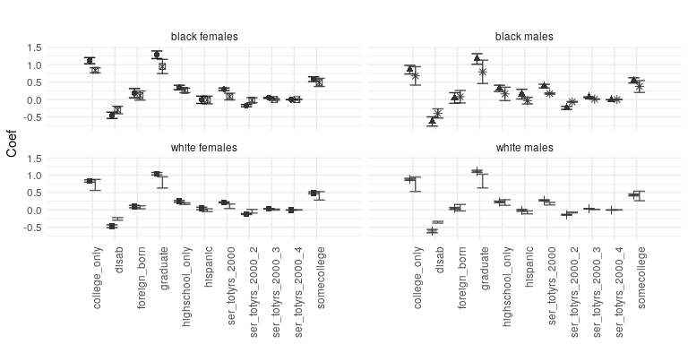
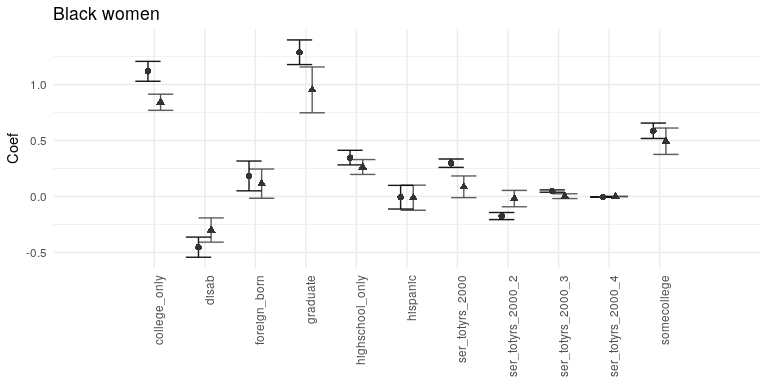
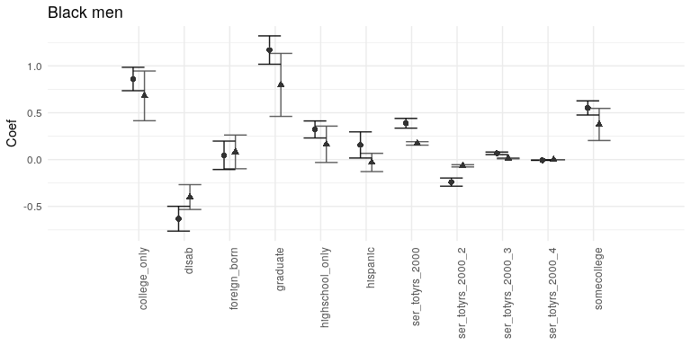
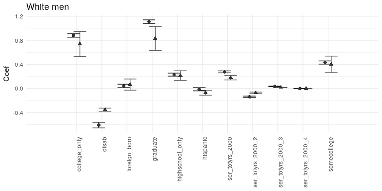
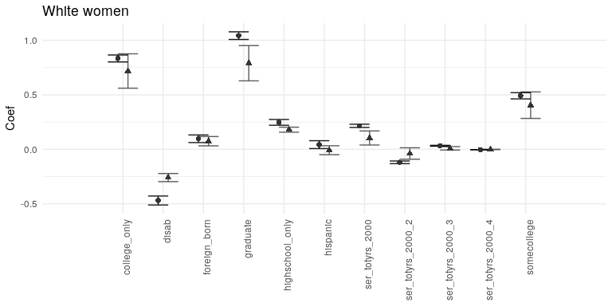

# Wiley Chapter - graphics - Fig 2 - regressions


```r
library(readxl)
library(tidyr)
library(dplyr)
```

```
## 
## Attaching package: 'dplyr'
```

```
## The following objects are masked from 'package:stats':
## 
##     filter, lag
```

```
## The following objects are masked from 'package:base':
## 
##     intersect, setdiff, setequal, union
```

```r
library(ggplot2)
library(RColorBrewer)
#library(gridExtra)
library(svglite)
widthfig <- 8
heightfig <- 4
```

```r
datalist = list()

for ( table in seq(1,4,1)) {
tmp <- read_excel("../data/Fig2/AnalyticValidityTables8.xls",skip = 2, sheet = table)
# get year
tmp <- tmp[,1:7]
names(tmp) <- c("Varname","Synthetic.Coef","Completed.Coef","Synthetic.CI_Lo","Synthetic.CI_Hi","Completed.CI_Lo","Completed.CI_Hi")
tmp.year <- names(read_excel("../data/Fig2/AnalyticValidityTables8.xls",n_max = 1, 
                             sheet = table ))[1]
tmp.year <- sub("  "," ",tmp.year)
print(paste("Processing ",tmp.year))
tmp$DemoGroup = paste(unlist(strsplit(tmp.year," "))[12],unlist(strsplit(tmp.year," "))[13],sep = " ")
tmp$year = as.numeric(unlist(strsplit(tmp.year," "))[10])
datalist[[table]] <- tmp
}
```

```
## [1] "Processing  Table 40: Log of Total DER Earnings in year 2000 for white males"
## [1] "Processing  Table 41: Log of Total DER Earnings in year 2000 for black males"
## [1] "Processing  Table 42: Log of Total DER Earnings in year 2000 for white females"
## [1] "Processing  Table 43: Log of Total DER Earnings in year 2000 for black females"
```

```r
AnalyticValidityTables8 <- do.call(rbind,datalist)
table(AnalyticValidityTables8$DemoGroup)
```

```
## 
## black females   black males white females   white males 
##            12            12            12            12
```


```r
# format it for graphing
mydf.new <-   gather(AnalyticValidityTables8,key,value,-DemoGroup,-year,-Varname) %>%
  separate(col = key,into=c("SynComplt","Stat"),extra="merge") %>%
  spread(key = Stat,value = value) %>%
  group_by(year,SynComplt,DemoGroup) %>%
  subset(Varname != "Intercept")
# Example table:
mydf.new$Type <- paste(mydf.new$SynComplt,mydf.new$DemoGroup,sep=", ")
mydf.new
```

```
## # A tibble: 88 x 8
## # Groups:   year, SynComplt, DemoGroup [8]
##         Varname     DemoGroup  year SynComplt      CI_Hi      CI_Lo
##           <chr>         <chr> <dbl>     <chr>      <dbl>      <dbl>
##  1 college_only black females  2000 Completed  1.2071866  1.0295215
##  2 college_only black females  2000 Synthetic  0.9140016  0.7697288
##  3 college_only   black males  2000 Completed  0.9851876  0.7349155
##  4 college_only   black males  2000 Synthetic  0.9452307  0.4149682
##  5 college_only white females  2000 Completed  0.8654451  0.8015887
##  6 college_only white females  2000 Synthetic  0.8763363  0.5609585
##  7 college_only   white males  2000 Completed  0.9089809  0.8513702
##  8 college_only   white males  2000 Synthetic  0.9466513  0.5300726
##  9        disab black females  2000 Completed -0.3632086 -0.5434525
## 10        disab black females  2000 Synthetic -0.1915512 -0.4084382
## # ... with 78 more rows, and 2 more variables: Coef <dbl>, Type <chr>
```

```r
# graph the whole thing
# Note: to array multiple plots - useful here - use "gridExtra" and grid.arrange()

gbf <- ggplot(subset(mydf.new,DemoGroup=="black females"),aes(x=Varname,y=Coef,fill=Type,color=Type))
gwf <- ggplot(subset(mydf.new,DemoGroup=="white females"),aes(x=Varname,y=Coef,fill=Type,color=Type))
gbm <- ggplot(subset(mydf.new,DemoGroup=="black males"),aes(x=Varname,y=Coef,fill=Type,color=Type))
gwm <- ggplot(subset(mydf.new,DemoGroup=="white males"),aes(x=Varname,y=Coef,fill=Type,color=Type))
gall <- ggplot(mydf.new,aes(x=Varname,y=Coef,fill=Type,color=Type))

myformat <- function(k,title="")  {
  k <- k + geom_errorbar(aes(ymin=CI_Lo,ymax=CI_Hi),alpha=0.9,width=1,position=position_dodge(0.5))  +
  geom_point(color="grey20",aes(shape=Type),size=2,position=position_dodge(0.5)) +
  theme_minimal() + ggtitle(title) +
  #scale_color_brewer(palette = "Set1") +
  scale_colour_grey(start = 0 , end=0.3) +
  scale_x_discrete("Variables",expand = c(0,2)) +
  theme(axis.text.x = element_text(angle = 90, hjust = 1),axis.title.x = element_blank()) +
  theme(legend.position="none")
  #theme(legend.title=element_blank(),legend.justification=c(1,0), legend.position=c(1,0.7)) 
  return(k)
}
#png("graph_ssb_coefs_alt.png",width=widthfig,height=heightfig)
#grid.arrange(myformat(gbf),myformat(gwf),myformat(gbm),myformat(gwm),ncol=2)
#pdf("graph_ssb_coefs_alt.pdf")

myformat(gall) + facet_wrap(~ DemoGroup)
```

```
## Warning: The shape palette can deal with a maximum of 6 discrete values
## because more than 6 becomes difficult to discriminate; you have 8.
## Consider specifying shapes manually if you must have them.
```

```
## Warning: Removed 22 rows containing missing values (geom_point).
```

<!-- -->

```r
ggsave("../figures/Fig2_graph_ssb_coefs_alt.png",width=widthfig,height=widthfig)
```

```
## Warning: The shape palette can deal with a maximum of 6 discrete values
## because more than 6 becomes difficult to discriminate; you have 8.
## Consider specifying shapes manually if you must have them.

## Warning: Removed 22 rows containing missing values (geom_point).
```

```r
ggsave("../figures/Fig2_graph_ssb_coefs_alt.svg",width=widthfig,height=widthfig)
```

```
## Warning: The shape palette can deal with a maximum of 6 discrete values
## because more than 6 becomes difficult to discriminate; you have 8.
## Consider specifying shapes manually if you must have them.

## Warning: Removed 22 rows containing missing values (geom_point).
```

```r
ggsave("../figures/Fig2_graph_ssb_coefs_alt.tiff",width=widthfig,height=widthfig)
```

```
## Warning: The shape palette can deal with a maximum of 6 discrete values
## because more than 6 becomes difficult to discriminate; you have 8.
## Consider specifying shapes manually if you must have them.

## Warning: Removed 22 rows containing missing values (geom_point).
```


```r
myformat(gbf,title="Black women")
```

<!-- -->

```r
ggsave("../figures/Fig2_graph_ssb_coefs_alt_gbf.png",width=widthfig,height=heightfig)
ggsave("../figures/Fig2_graph_ssb_coefs_alt_gbf.svg",width=widthfig,height=heightfig)
ggsave("../figures/Fig2_graph_ssb_coefs_alt_gbf.tiff",width=widthfig,height=heightfig)
```

```r
myformat(gbm,title="Black men")
```

<!-- -->

```r
ggsave("../figures/Fig2_graph_ssb_coefs_alt_gbm.png",width=widthfig,height=heightfig)
ggsave("../figures/Fig2_graph_ssb_coefs_alt_gbm.svg",width=widthfig,height=heightfig)
ggsave("../figures/Fig2_graph_ssb_coefs_alt_gbm.tiff",width=widthfig,height=heightfig)
```

```r
myformat(gwm,title="White men")
```

<!-- -->

```r
ggsave("../figures/Fig2_graph_ssb_coefs_alt_gwm.png",width=widthfig,height=heightfig)
ggsave("../figures/Fig2_graph_ssb_coefs_alt_gwm.svg",width=widthfig,height=heightfig)
ggsave("../figures/Fig2_graph_ssb_coefs_alt_gwm.tiff",width=widthfig,height=heightfig)
```

```r
myformat(gwf,title="White women")
```

<!-- -->

```r
ggsave("../figures/Fig2_graph_ssb_coefs_alt_gwf.png",width=widthfig,height=heightfig)
ggsave("../figures/Fig2_graph_ssb_coefs_alt_gwf.svg",width=widthfig,height=heightfig)
ggsave("../figures/Fig2_graph_ssb_coefs_alt_gwf.tiff",width=widthfig,height=heightfig)
```
